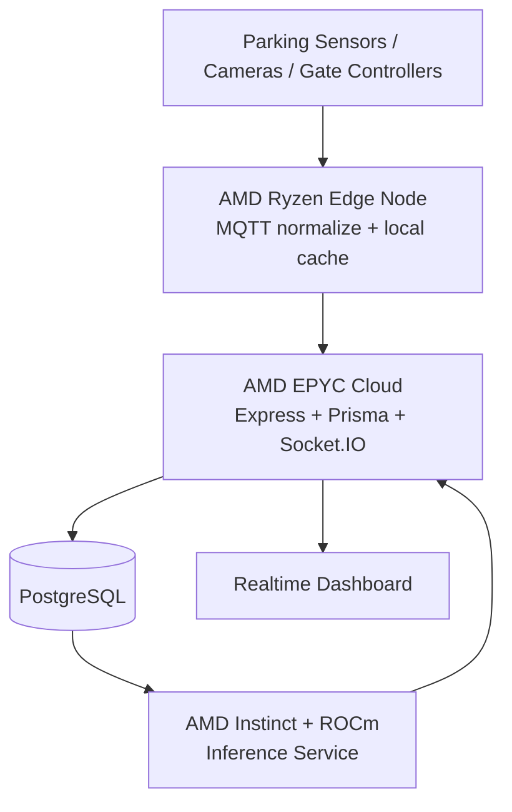
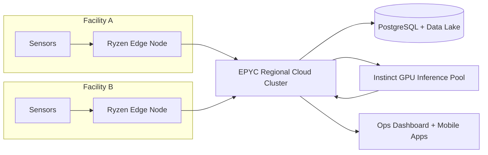

# AMD Architecture Alignment — SmartPark AI

## Objective

Position SmartPark AI as an AMD-aligned edge-to-cloud smart city platform that runs as a prototype now and scales cleanly to production.

## 1. AMD Architecture Mapping:

| SmartPark Component | AMD Technology | Practical Role |
|---|---|---|
| Express API + Socket.IO gateway | AMD EPYC | High-core backend concurrency for API + websocket fan-out |
| PostgreSQL + Prisma workloads | AMD EPYC | Parallel transactional + analytical query execution |
| Facility edge gateway | AMD Ryzen | On-site MQTT processing, local buffering, and uplink retries |
| AI inference microservice (next phase) | AMD Instinct GPUs | Fast occupancy and demand inference workloads |
| ML runtime | ROCm ecosystem | Open AI stack for model serving/training on AMD GPUs |
| Device/control tier model | AMD Adaptive SoCs | Edge signal pre-processing and control-plane readiness |

## 2. Edge -> Cloud -> AI Pipeline:

## 3. Why AMD Is Technically Beneficial:

### Backend and Realtime (EPYC)

- Socket-heavy workloads benefit from many CPU cores for process-level parallelism.
- Mixed API and websocket traffic can be isolated across workers while keeping low latency.
- Reservation and analytics endpoints can run concurrently with reduced contention.

### Edge Processing (Ryzen)

- Facility-level preprocessing reduces cloud roundtrips for noisy telemetry.
- Supports lightweight inference or rule evaluation before publishing to cloud.
- Useful for intermittent connectivity with local queue + replay patterns.

### AI Acceleration (Instinct + ROCm)

- Predictive services (occupancy forecasting, anomaly scoring) can run on dedicated GPU tier.
- ROCm enables standard PyTorch-based workflows with AMD acceleration.
- Keeps inference decoupled from transactional backend for stable API latency.

## 4. Smart City Deployment Model:

## 5. Implementation Path for SmartPark AI:

1. **Current prototype**: Render deployment, realtime dashboard, simulation routes.
2. **Edge enablement**: deploy MQTT forwarder and payload signer on Ryzen edge node.
3. **AI service split**: add FastAPI inference service on ROCm-compatible AMD GPU nodes.
4. **Scale-out**: add Redis adapter for Socket.IO and queue-based ingestion workers.
5. **City rollout**: multi-facility tenancy with regional EPYC clusters and centralized monitoring.

## 6. Hackathon Positioning Summary

SmartPark AI already demonstrates the software pipeline expected in a production smart-city platform. The AMD mapping provides a realistic hardware evolution path:

- Ryzen at edge for resilience and reduced latency,
- EPYC in cloud for scalable backend and data plane,
- Instinct + ROCm for AI-powered optimization.
